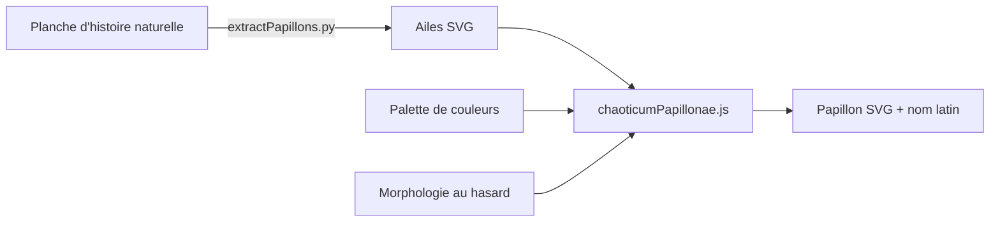

# Chaoticum Papillonae — documentation

Générateur de papillons imaginaires en SVG, à partir de formes d'ailes extraites de planches d'histoire naturelle.

| Document | Pour qui | Contenu |
|---|---|---|
| [Manuel d'utilisation](utilisation.md) | Toute personne qui utilise la page | Générer, choisir aile et palette, nom latin, enregistrer, importer une planche |
| [Installation](installation.md) | Administration | Installation locale, mise en ligne Docker sur un VPS Debian, comptes, sauvegardes |
| [Documentation technique](technique.md) | Développement | Architecture, algorithmes de génération et d'extraction, API, sécurité |

