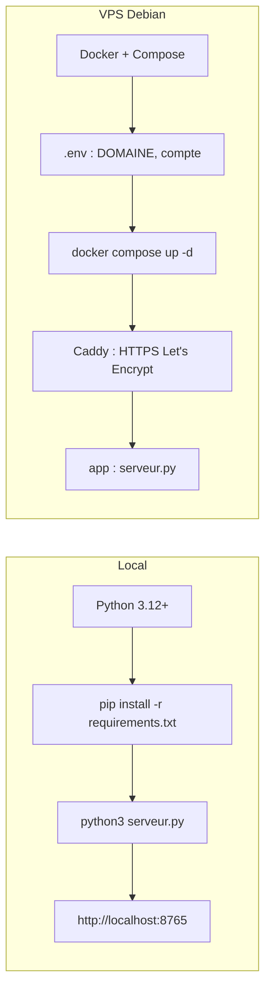
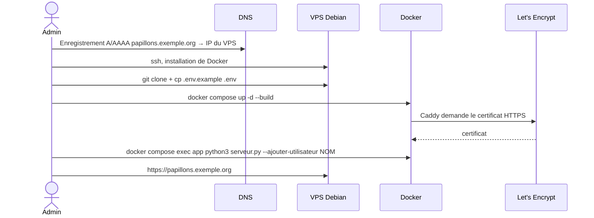

# Installation

Deux façons d'installer Chaoticum Papillonae :

- **en local**, pour développer ou utiliser l'application sur son ordinateur ;
- **sur un VPS Debian avec Docker**, pour la mettre en ligne en HTTPS.



## Installation locale

### Prérequis

- Python 3.12 ou plus récent ;
- `pip` pour installer NumPy et OpenCV.

### Étapes

```bash
git clone <dépôt> ChaoticumPapillonae
cd ChaoticumPapillonae
python3 -m venv .venv && source .venv/bin/activate
pip install -r requirements.txt
python3 serveur.py --ajouter-utilisateur moi     # compte pour l'import de planches
python3 serveur.py                               # http://localhost:8765
```

Le serveur n'écoute que sur `127.0.0.1` par défaut. Sans compte, la génération de papillons fonctionne, mais l'import de planches reste inaccessible.

> Ouvrir `index.html` directement depuis le disque ne fonctionne pas : le navigateur refuse de charger les SVG des ailes. Il faut passer par `serveur.py` (ou, sans import, par n'importe quel serveur web statique).

### Extraire une planche en ligne de commande

```bash
python3 extractPapillons.py chemin/planche.jpg --prefixe maplanche
python3 extractPapillons.py "https://exemple.org/planche.webp" --prefixe godart53 --debug
```

## Mise en ligne sur un VPS Debian



### 1. Prérequis

- Un VPS **Debian 12** (1 vCPU et 1 Go de RAM suffisent ; 2 Go conseillés pour les grandes planches) ;
- un **nom de domaine** dont l'enregistrement DNS `A` (et `AAAA` en IPv6) pointe vers l'IP du VPS ;
- les ports **80** et **443** ouverts.

### 2. Installer Docker

```bash
sudo apt-get update
sudo apt-get install -y ca-certificates curl git
sudo install -m 0755 -d /etc/apt/keyrings
sudo curl -fsSL https://download.docker.com/linux/debian/gpg -o /etc/apt/keyrings/docker.asc
echo "deb [arch=$(dpkg --print-architecture) signed-by=/etc/apt/keyrings/docker.asc] https://download.docker.com/linux/debian $(. /etc/os-release && echo $VERSION_CODENAME) stable" | sudo tee /etc/apt/sources.list.d/docker.list
sudo apt-get update
sudo apt-get install -y docker-ce docker-ce-cli containerd.io docker-compose-plugin
sudo usermod -aG docker $USER      # puis se reconnecter
```

Pare-feu (si `ufw` est utilisé) :

```bash
sudo ufw allow OpenSSH && sudo ufw allow 80/tcp && sudo ufw allow 443 && sudo ufw enable
```

### 3. Récupérer l'application et la configurer

```bash
git clone <dépôt> chaoticum && cd chaoticum
cp .env.example .env
nano .env
```

| Variable | Rôle |
|---|---|
| `DOMAINE` | Nom de domaine du site (obligatoire) |
| `CP_COOKIE_SECURE` | `1` en production : le cookie de session ne circule qu'en HTTPS |
| `CP_ADMIN_USER`, `CP_ADMIN_PASSWORD` | Facultatif : compte créé ou mis à jour à chaque démarrage |

### 4. Démarrer

```bash
docker compose up -d --build
docker compose logs -f        # Ctrl+C pour quitter
```

Caddy obtient automatiquement le certificat HTTPS au premier accès. Le site est alors disponible sur `https://DOMAINE`.

### 5. Gérer les comptes

```bash
docker compose exec app python3 serveur.py --ajouter-utilisateur NOM     # créer / changer le mot de passe
docker compose exec app python3 serveur.py --utilisateurs                # lister
docker compose exec app python3 serveur.py --supprimer-utilisateur NOM
```

Les mots de passe font au moins 10 caractères. Ils sont stockés hachés (PBKDF2-SHA256) dans le volume `comptes`. Si `CP_ADMIN_PASSWORD` est utilisé, mieux vaut le vider dans `.env` une fois le compte créé.

### Données et sauvegardes

Les données modifiées par l'application vivent dans des volumes Docker, conservés lors des mises à jour :

| Volume | Contenu |
|---|---|
| `comptes` | `utilisateurs.json` (comptes hachés) |
| `modeles` | ailes SVG et `modeles.json` |
| `extraits` | papillons détourés (PNG) |
| `sources` | planches importées |
| `caddy_data` | certificats HTTPS |

Sauvegarde d'un volume (le préfixe dépend du nom du dossier, ici `chaoticum`) :

```bash
docker run --rm -v chaoticum_modeles:/v -v "$PWD":/b debian:12-slim tar czf /b/modeles.tgz -C /v .
```

### Mettre à jour

```bash
git pull
docker compose up -d --build
```

> Au premier démarrage, Docker remplit les volumes `modeles` et `extraits` avec les ailes livrées dans l'image. Ensuite, ce sont les volumes qui font foi : les ailes ajoutées à l'image par une mise à jour n'y sont pas recopiées. Pour les intégrer, les réimporter depuis la page ou supprimer le volume (en perdant les imports).

## Dépannage

| Symptôme | Cause probable |
|---|---|
| « le serveur ne gère pas l'import » | Page servie sans `serveur.py` |
| La section *Importer une planche* n'apparaît pas | `api/moi` inaccessible : vérifier `docker compose logs app` |
| Connexion refusée en HTTP | `CP_COOKIE_SECURE=1` sans HTTPS : passer par le domaine, ou mettre `0` pour un test |
| « trop d'essais » | 10 échecs de connexion en 15 minutes depuis la même IP : patienter |
| Certificat non délivré | DNS pas encore propagé ou ports 80/443 fermés |
