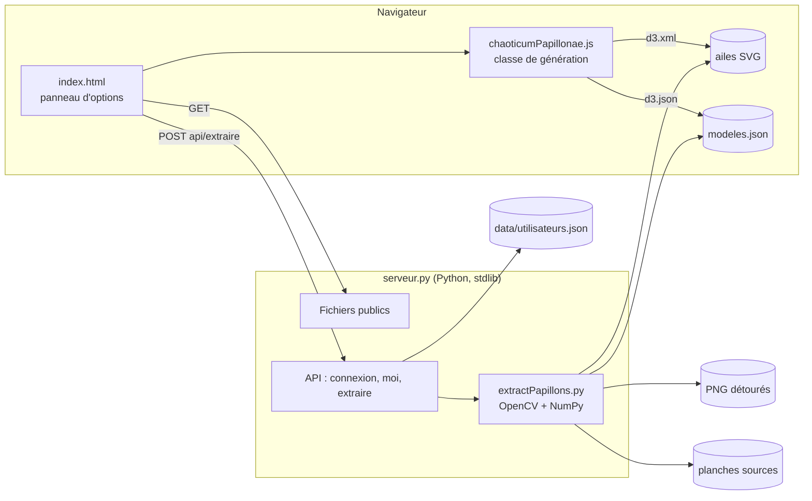
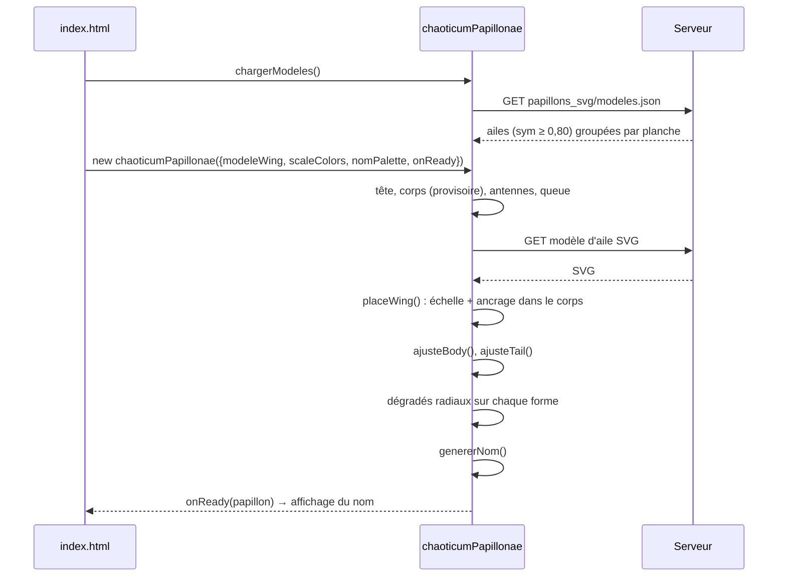
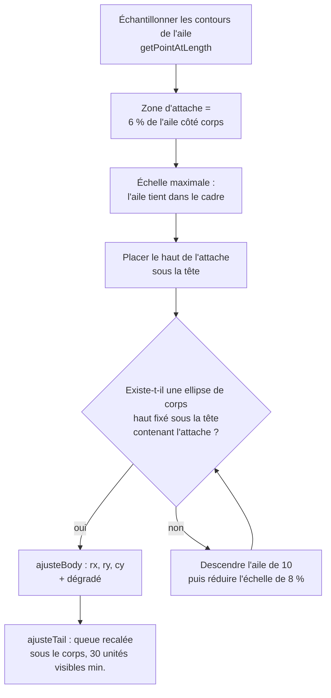
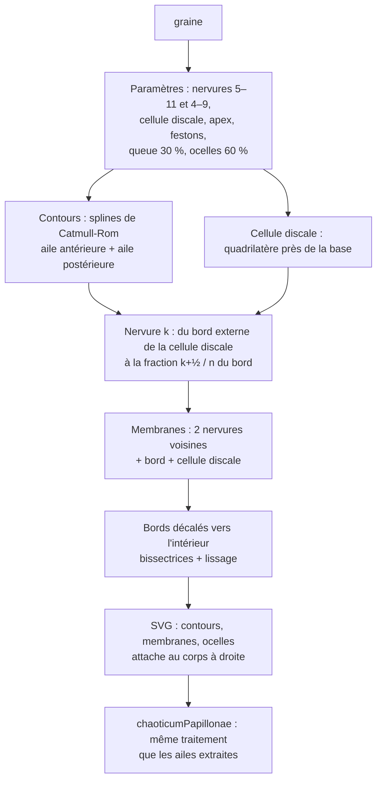
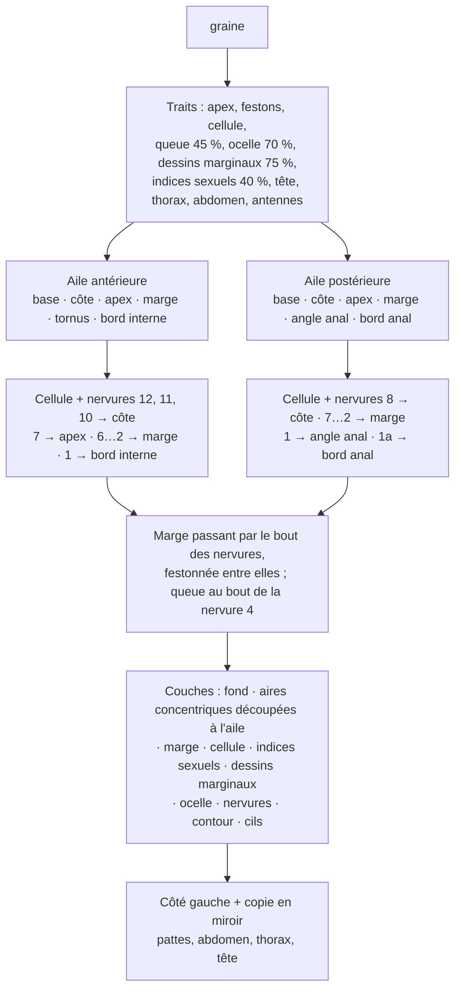
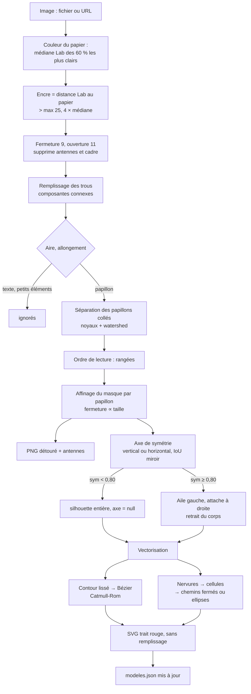
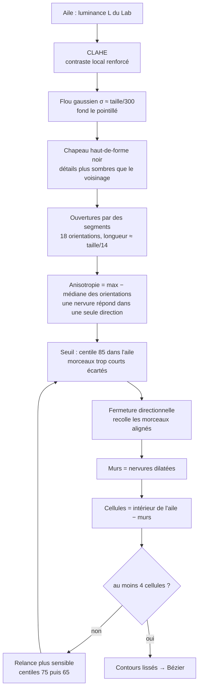
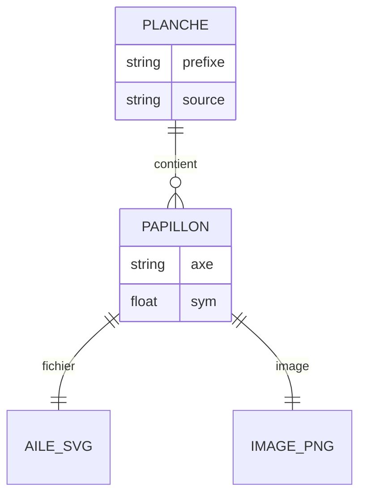
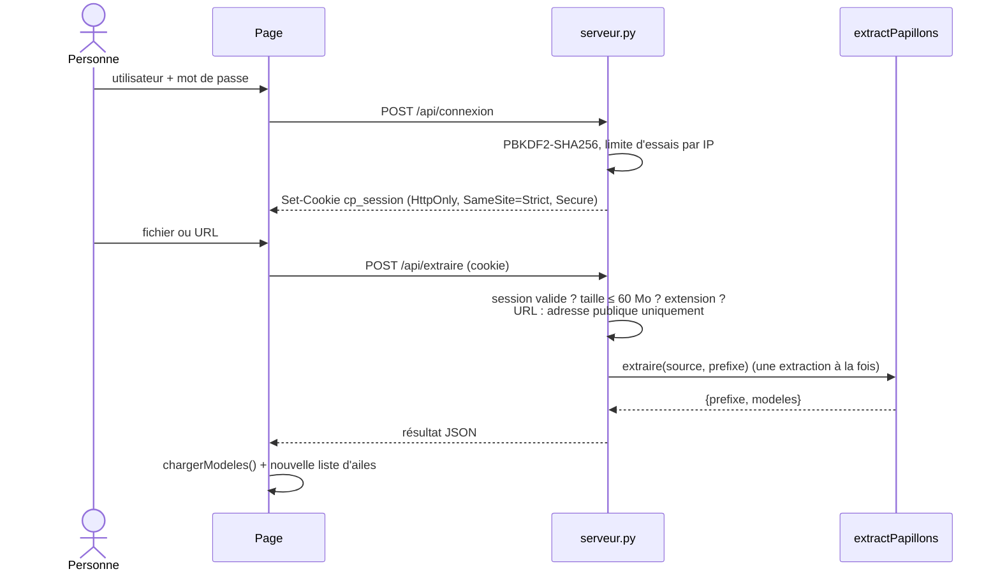
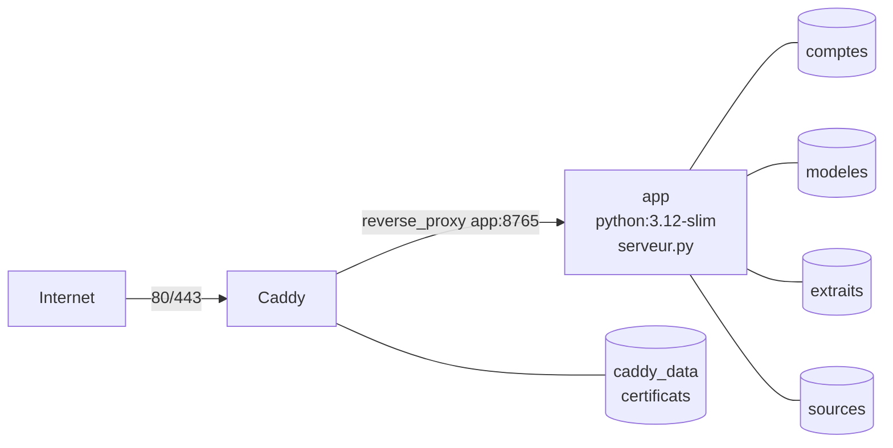

# Documentation technique

## Architecture



| Fichier | Rôle |
|---|---|
| `index.html` | Interface : panneau d'options, listes avec aperçus, import, export PNG/SVG |
| `asset/js/chaoticumPapillonae.js` | Classe qui construit le papillon SVG avec D3 v7 |
| `asset/js/ailesGenerees.js` | Modèle de nervation : génère des ailes (`genere:<graine>`) |
| `asset/js/papillonAnatomique.js` | Méthode anatomique : papillon entier construit d'après les schémas de Wikimédia Commons |
| `extractPapillons.py` | Détection des papillons d'une planche et vectorisation d'une aile |
| `serveur.py` | Serveur HTTP : fichiers publics, comptes, sessions, API d'import |
| `papillons_svg/modeles.json` | Manifeste des ailes extraites |
| `papillons_svg/*.svg`, `papillons_extraits/*.png` | Ailes vectorisées et papillons détourés |
| `asset/svg/papiAile*.svg` | Ailes dessinées à la main (Inkscape) |
| `Dockerfile`, `docker-compose.yml`, `deploy/Caddyfile` | Mise en ligne |

## Génération d'un papillon (navigateur)



### Construction

Le papillon est dessiné dans un carré de 600 × 600 unités, découpé en bandes (`d3.scaleBand`) verticales (`wing1…tail3`) et horizontales (`wing1…wing6`) qui bornent les tirages aléatoires de la tête, du corps, de la queue et des antennes.

- **Antennes** : une courbe de Bézier quadratique (`Q` puis `T`) dont tous les points de contrôle sont à gauche de l'axe ; l'antenne droite est son miroir. Une courbe restant dans l'enveloppe convexe de ses points de contrôle, les deux antennes ne se croisent jamais.
- **Ailes** : le modèle SVG est importé deux fois ; l'aile droite est le miroir (`matrix(-1 0 0 1 2cx 0)`) de la gauche, avec le même placement.
- **Couleurs** : chaque forme reçoit un dégradé radial dont les arrêts sont tirés dans la palette (`scaleColors(Math.random())`), ou en RVB pur sans palette.

### Placement des ailes dans le corps



Le corps garde son sommet sous la tête et ne grandit que vers le bas ; de la place est réservée pour la queue (`queueMin`).

### Nom latin

`genererNom()` combine : un **genre** dérivé du nom du fichier d'aile (empreinte FNV-1a → syllabes + suffixe), une **espèce** tirée de la palette (table de traduction et racines latines des codes ColorBrewer : `Yl` → *flavo*, `Rd` → *rubro*…), une **sous-espèce** décrivant l'allongement du corps et l'envergure, et un **code** hexadécimal (empreinte de toutes les dimensions).

### Reproductibilité : graine

Toutes les dimensions tirées au hasard (tête, corps, queue, antennes, choix d'aile par défaut) viennent d'un générateur `d3.randomLcg(graine)`, dans un ordre fixe. Les couleurs d'un dégradé sont tirées d'un générateur initialisé par `graine + id de la forme` : une forme garde ses couleurs quand on modifie les autres (nervures, ocelles), et un papillon regénéré depuis son URL est identique à l'octet près.

### Modes de dégradé

`chaoticumPapillonae.MODES_DEGRADE` liste les modes (`radial`, `lineaire`, `rayures`, `anneaux`, `mixte`) ; les deux classes reçoivent `modeDegrade`. `chaoticumPapillonae.ajouterDegrade(defs, id, mode, cx, cy, r, graine)` crée la géométrie du dégradé (sans ses couleurs) : `radialGradient` centré, ou `linearGradient` de diamètre 2r selon un angle tiré de la graine et de l'`id` ; en `mixte`, le mode de chaque élément est tiré de la même façon. Les couleurs sont ajoutées ensuite comme avant (le mode radial redonne exactement les papillons existants), puis `finaliserDegrade` répète les arrêts de couleur : 6 fois pour les rayures, 3 fois en miroir pour les anneaux. Cette répétition explicite remplace `spreadMethod`, ignoré par l'export PNG (canvg).

Écailles : la valeur de palette d'une écaille mêle à parts égales la valeur de sa zone et un champ selon le mode — projection sur une direction (linéaire), sinusoïde de cette projection (rayures) ou de la distance à la base (anneaux).

### Proportions du corps et de la queue

Après l'ajustement du corps aux ailes, `appliquerProportions()` multiplie largeur et longueur du corps (le haut reste sous la tête) puis de la queue (la partie visible sous le corps), dans la limite du cadre. `papillon.proportions({corpsL, corpsH, queueL, queueH})` les change en temps réel.

### URL de partage

La page lit `aile`, `palette`, `graine`, `corps` et `queue` dans l'URL au chargement (valeurs vérifiées : aile générée ou présente dans la liste, palette connue, facteurs entre 0,3 et 2,5), et réécrit l'URL (`history.replaceState`) à chaque papillon terminé ou modifié. **Partager** utilise `navigator.share` sur les écrans tactiles, sinon le presse-papiers.

### API de la classe

```js
await chaoticumPapillonae.chargerModeles();          // lit modeles.json
const papillon = new chaoticumPapillonae({
    cont: d3.select("#div"),        // conteneur
    idSvg: "monPapillon",
    width: 1000, height: 1000,
    modeleWing: "papillons_svg/papillon_05.svg",   // sinon tirage au hasard
    scaleColors: d3.scaleSequential(d3.interpolateMagma), // false = RVB
    nomPalette: "Magma",
    graine: 777,                    // même graine → même papillon
    proportions: {corpsL: 1.2, corpsH: 1, queueL: 1, queueH: 1.5},
    onOcelles: liste => {},         // ocelles déplacés / supprimés (ailes générées)
    onReady: p => console.log(p.nom)
});
papillon.changerAile("genere:42?ep=4");          // remplace les ailes, garde le reste
papillon.proportions({corpsL: 0.8});             // redimensionne le corps
```

| Propriété statique | Contenu |
|---|---|
| `ailesDessinees` | Ailes dessinées livrées avec l'application |
| `modelesWing` | Toutes les ailes utilisables |
| `planches` | `[{prefixe, source, modeles}]` |
| `images` | Fichier d'aile → PNG du papillon d'origine |
| `symMin` | Symétrie minimale pour qu'une aile soit proposée (0,80) |

## Ailes générées (modèle de nervation)

`ailesGenerees.js` produit des ailes selon le plan de nervation des lépidoptères (système de Comstock-Needham) : une cellule discale fermée près de la base, des nervures radiales jusqu'au bord, et les membranes entre nervures voisines. Un modèle se note `genere:<graine>` ; tous les paramètres sont tirés d'un générateur pseudo-aléatoire initialisé par la graine (même graine → même aile).



- Les nervures sont tracées dans l'ordre et chacune relie des positions croissantes sur la cellule discale et sur le bord : elles ne se croisent jamais.
- L'aile postérieure est écrite avant l'aile antérieure, qui la recouvre.
- Le SVG a le format des ailes extraites (`<path>` fermés et `<ellipse>`, `id` uniques) : placement dans le corps, dégradés et nom latin sont inchangés. `chaoticumPapillonae` construit le document avec `DOMParser` au lieu de `d3.xml`.
- Dans la page, une aile sur quatre tirée au hasard est générée (`PART_GENEREES`), et la liste propose huit graines d'exemple (`GRAINES_EXEMPLES`).
- **Réglages** : `AilesGenerees.REGLAGES` décrit les paramètres modifiables (`nf`, `nh`, `ep`, `dc`, `ap`, `sc`, `tl`, `oc`, `ot`). Un modèle réglé se note `genere:<graine>?ep=12&tl=1` : seuls les réglages qui s'écartent de la graine de plus d'un demi-pas sont notés (`AilesGenerees.modele(graine, valeurs)`), et `AilesGenerees.parametres(modele)` relit l'ensemble. Les ocelles occupent les `oc` premiers emplacements d'un ordre fixé par la graine : augmenter leur nombre en ajoute sans déplacer les autres.
- **Ocelles placés à la main** : le paramètre `of=x,y,r;x,y,r` (coordonnées de l'aile, longueur 1) remplace les ocelles automatiques. Les `<ellipse class="ocelle">` portent leur position d'origine (`data-x`, `data-y`, `data-r`) ; `chaoticumPapillonae` les rend déplaçables (`d3.drag`, conversion du pointeur avec `getScreenCTM()`, miroir compris) et supprimables (double-clic), puis appelle `onOcelles([{x, y, r}])` ; la page en fait un nouveau modèle `of=…`.
- **Temps réel** : `papillon.changerAile(modele)` remplace les ailes du papillon affiché. Le corps et la queue repartent de leurs dimensions d'avant l'ajustement aux ailes, puis sont réajustés ; les dégradés existants (identifiés par l'`id` des formes) sont réutilisés, donc les couleurs ne changent pas. Côté page, les curseurs sont limités à un rendu par image (`requestAnimationFrame`).

## Méthode anatomique (`PapillonAnatomique`)

Classe indépendante de `chaoticumPapillonae` (la méthode par modèles d'ailes est conservée), avec la même interface : `cont`, `idSvg`, `width`, `height`, `scaleColors`, `nomPalette`, `graine`, `proportions`, `onReady`, et les propriétés `nom`, `graine`, `nomPalette`, la méthode `proportions(p)`. Elle suit le vocabulaire des schémas *Schéma d'un lépidoptère* et *Ailes de lépidoptères* (Wikimédia Commons) ; chaque élément SVG porte son nom en `id` ou en classe (`aile-anterieure-gauche`, `nervure-7`, `aire-mediane`, `cellule`, `dessin-marginal`, `ocelle`, `cils`, `thorax`, `femur`…).



- **Ailes** : coordonnées locales (base en 0,0, longueur 1), puis `translate` + `scale` vers la base sur le thorax ; l'échelle est la plus grande qui garde l'aile antérieure et la queue dans le cadre 600 × 600. L'aile postérieure est dessinée sous l'aile antérieure.
- **Aires** : couronnes centrées sur la base (basale 0–20 %, post-basale 20–34 %, médiane 34–54 %, post-médiane 54–74 % du rayon de l'aile) et cercles autour de l'apex (sub-apicale, apicale), découpés par un `clipPath` à la forme de l'aile ; la marge est un trait épais le long du bord externe, découpé de même.
- **Symétrie** : le côté droit (ailes, pattes, antennes, palpes, yeux) est une **copie** en miroir des éléments du côté gauche (`cloneNode`, `id` retirés, classes `-gauche` → `-droite`) ; un `<use>` serait ignoré par l'export PNG (canvg). Tête, trompe, thorax et abdomen sont centrés.
- **Écailles** (option `ecailles`, par défaut) : rangées décalées de petites palettes à bout arrondi, placées en couronnes autour de la base (pas radial ≈ 0,62 × longueur d'écaille, pour qu'elles se recouvrent), pointe vers la marge. Chaque écaille reçoit une valeur de palette : celle de sa zone (cellule, marge, aire apicale ou sub-apicale, aires basale à post-médiane — tirée de la graine et de la zone) plus une variation propre de ± 0,07. Les écailles d'une même rangée et d'une même couleur (48 niveaux) forment un seul `<path>`, dessinés des rangées externes vers la base : le bout de chaque écaille recouvre la base de la suivante. Environ 1 800 écailles pour un papillon, rendu en ~40 ms.
- **Contour et courbure** : le contour de chaque aile est une seule spline de Catmull-Rom fermée (base, côte, apex, marge, angle externe ou anal, bord interne ou anal), découpée ensuite en côte, marge et bord : il n'y a pas d'angle vif à l'apex ni aux angles. `courbure` (0,5 par défaut) bombe la côte, la marge et le bord interne et émousse l'apex ; les coins restants sont toujours un peu adoucis (rééchantillonnage + coupe des coins de Chaikin), davantage avec la courbure. Les nervures suivent la marge.
- **Jonction des ailes** : l'apex et la côte de l'aile postérieure passent sous l'aile antérieure, et les festons s'atténuent sur le premier et le dernier quart de la marge (près de l'apex et de l'angle externe ou anal) : aucun trou n'apparaît entre les deux ailes, même avec des festons profonds.
- **Marge** : bande pleine dont le bord externe est exactement la portion du contour (arrondi) comprise entre l'apex et l'angle externe ou anal ; le bord interne est décalé vers l'intérieur (normale orientée par le sens de parcours du contour, aire signée) de `largeurMarge`, aminci aux extrémités et ondulé entre les nervures (`ondulationMarge`). Couleur `couleurMarge` (`degrade` ou `#rrggbb`), opacité `opaciteMarge` ; la bande est dessinée au-dessus des écailles ou des aires et découpée à la forme de l'aile. Les cils suivent ce même bord réel.
- **Corps** : `couleurTete`, `couleurThorax`, `couleurAbdomen` valent `degrade` (dégradé de la palette) ou une couleur `#rrggbb` (plein) ; `pattes` (faux par défaut) affiche les trois paires de pattes.
- **Antennes** (schéma « Les différents types d'antennes ») : une suite d'articles (trapèzes) le long d'une courbe, dont la largeur dépend du type — *en massue* (articles qui s'élargissent, bout arrondi), *épaisse* (largeur maximale aux deux tiers, pointe recourbée), *filiforme* (articles fins, soies aux articulations), *plumeuse* (axe fin, barbes plus longues au milieu, en forme de feuille).
- **Réglages** : `PapillonAnatomique.REGLAGES` décrit les traits modifiables (ailes, yeux, antennes ; curseur, case à cocher ou liste). `papillon.regler({cle: valeur})` les impose par-dessus les traits tirés de la graine et reconstruit le papillon (`regler(null)` revient à la graine) ; `papillon.traits` donne les valeurs courantes. Dans l'URL : `ana=cle=valeur;…` (`reglagesVersTexte` / `texteVersReglages`). Les traits ajoutés depuis la première version (type d'antenne, articles, yeux, taille des ailes) sont tirés d'un générateur séparé : les graines déjà partagées gardent leur forme.
- **Couleurs** : dégradés radiaux tirés d'après la graine et l'`id` de l'élément (comme `chaoticumPapillonae`) ; le trait (nervures, contours, pattes) est la teinte la plus sombre de la palette, assombrie.
- **Proportions** : `corpsL` / `corpsH` agissent sur le thorax et l'abdomen, `queueL` / `queueH` sur la queue de l'aile postérieure ; le papillon est reconstruit (même graine, mêmes couleurs).
- **Nom** : genre d'après la graine, espèce d'après la palette (fonctions statiques `chaoticumPapillonae.nomGenre`, `nomEspece`, `hash`), sous-espèce *caudata* / *ocellata* / *simplex* (+ *-acuta* si l'apex est pointu).

Dans la page, `methode=anatomique` dans l'URL sélectionne cette méthode.

## Extraction d'une planche



Points clés :

- **Seuil adaptatif** : le grain du papier (médiane de la distance au papier) relève le seuil sur un papier irrégulier, et le laisse à 25 sur un papier lisse où les zones d'aile pâles sont proches du papier.
- **Affinage par papillon** : une fermeture de taille *min(largeur, hauteur) / 20*, limitée au voisinage du papillon et sans empiéter sur ses voisins, bouche les entailles dues aux zones pâles.
- **Symétrie** : IoU entre une moitié et le miroir de l'autre, pour tous les axes possibles entre 30 % et 70 % de la largeur (ou de la hauteur).
- **Cellules** : l'intérieur de l'aile est découpé par ses **nervures**, pas par ses couleurs (voir ci-dessous) ; les cellules sont séparées par un espace (la nervure) et ne touchent pas le contour ; les petites cellules rondes (circularité > 0,8) deviennent des `<ellipse>`.

### Détection des nervures

Les gravures mêlent nervures (traits fins et longs), pointillé (points denses) et aplats colorés. Le traitement isole les premiers :



Toutes les tailles de filtres sont proportionnelles à la taille de l'aile : une petite aile de la première planche (300 px) et une grande aile de Godart (1 100 px) sont traitées de la même façon. Les ailes dont les nervures ne sont presque pas gravées (papillons de nuit à grosses taches) gardent peu de cellules.

### Manifeste `papillons_svg/modeles.json`

```json
{
 "modeles": [
  {
   "fichier": "papillons_svg/godart53_02.svg",
   "image": "papillons_extraits/godart53_02.png",
   "axe": "v",
   "sym": 0.906,
   "prefixe": "godart53",
   "source": "asset/img/sources/histoirenaturell01godart_0053_full.webp"
  }
 ]
}
```

`axe` vaut `v` (corps vertical), `h` (corps horizontal, l'aile est tournée) ou `null` (pas de symétrie : non proposé comme modèle). Réextraire un préfixe remplace ses entrées.

### Corrections d'orientation `papillons_svg/corrections.json`

Pour un corps horizontal (`axe = h`), le script ne sait pas de quel côté est la tête : l'aile peut sortir à l'envers. Les ailes à retourner sont listées dans `corrections.json` (`{"papillon_17": {"retourner": true}}`) ; le retournement est un `transform="matrix(1 0 0 -1 0 h)"` sur le groupe de l'aile, réappliqué à chaque extraction, et le manifeste indique `"retourne": true`.

```bash
python3 extractPapillons.py --retourner papillon_17 papillon_28   # bascule
```



## Serveur et sécurité

| Méthode | Chemin | Accès | Rôle |
|---|---|---|---|
| GET | fichiers publics | tous | `index.html`, pages à la racine, `asset/`, `papillons_svg/`, `papillons_extraits/`, `docs/` |
| GET | `/api/moi` | tous | `{"utilisateur": nom \| null}` |
| POST | `/api/connexion` | tous | `{"utilisateur", "mot_de_passe"}` → cookie de session |
| POST | `/api/deconnexion` | tous | supprime la session |
| POST | `/api/extraire?nom=…&prefixe=…` | connecté | corps = octets de l'image |
| POST | `/api/extraire?url=…&prefixe=…` | connecté | image téléchargée par le serveur |
| POST | `/api/retourner?fichier=…` | connecté | retourne une aile haut/bas (bascule), mémorisé dans `corrections.json` |



Mesures en place :

- **Liste blanche des fichiers servis** : ni code Python, ni `data/`, ni `.git`, ni liste des dossiers.
- **Mots de passe** hachés PBKDF2-SHA256 (240 000 itérations, sel aléatoire), comparaison à temps constant ; fichier des comptes en `0600`.
- **Sessions** aléatoires (`secrets.token_urlsafe`), en mémoire, 12 h ; un redémarrage déconnecte tout le monde.
- **Anti-force brute** : 10 échecs par IP en 15 minutes (`X-Forwarded-For` lu seulement si `CP_PROXY=1`).
- **Import par URL** : seules les adresses publiques sont autorisées, redirections comprises (protection SSRF) ; taille limitée à 60 Mo.
- **Conteneur** : utilisateur sans privilèges (`uid 1000`), seuls les dossiers d'import lui appartiennent ; le port 8765 n'est publié que sur `127.0.0.1`, l'accès public passe par Caddy (HTTPS, HSTS).

## Déploiement Docker



Variables d'environnement de `serveur.py` :

| Variable | Défaut | Rôle |
|---|---|---|
| `CP_HOTE` | `127.0.0.1` (`0.0.0.0` dans l'image) | Adresse d'écoute |
| `CP_PORT` | `8765` | Port |
| `CP_DATA` | `data` | Dossier des comptes |
| `CP_COOKIE_SECURE` | `0` (`1` via Compose) | Cookie limité à HTTPS |
| `CP_PROXY` | `0` (`1` via Compose) | Lit l'IP cliente dans `X-Forwarded-For` |
| `CP_ADMIN_USER` / `CP_ADMIN_PASSWORD` | — | Compte créé ou mis à jour au démarrage |

## Documentation

Les sources sont les fichiers Markdown de `docs/`. Les pages HTML sont générées par :

```bash
python3 docs/construire.py
```

Elles affichent le Markdown avec [marked](https://marked.js.org/) et les diagrammes avec [Mermaid](https://mermaid.js.org/), chargés depuis un CDN.
