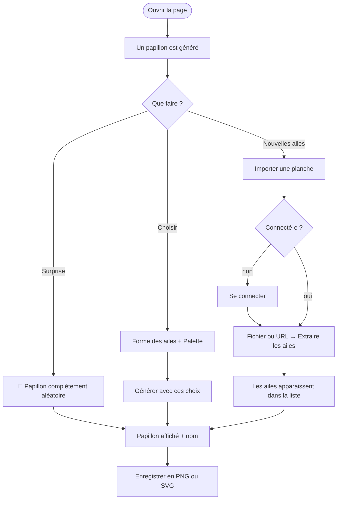

# Manuel d'utilisation

Chaoticum Papillonae génère des papillons imaginaires en SVG. Le papillon occupe la page, et tous les réglages sont dans le panneau à droite. Chaque papillon combine une **forme d'aile** (tirée de planches d'histoire naturelle, dessinée à la main ou générée par un modèle de nervation), avec une **palette de couleurs** et une morphologie (tête, corps, queue, antennes) tirée au hasard.

## Vue d'ensemble de la page

| Zone | Rôle |
|---|---|
| Nom en italique (en haut du panneau) | Nom latin généré pour le papillon affiché |
| Vignettes sous le nom | Forme d'aile utilisée et papillon de la planche dont elle provient |
| Boutons PNG, SVG et Partager | Enregistrer le papillon (image PNG ou SVG vectoriel) ou copier le lien qui le regénère |
| 🎲 Papillon complètement aléatoire | Tire une aile et une palette au hasard |
| Forme des ailes | Choix de l'aile, avec aperçu de la forme et du papillon d'origine |
| Palette de couleurs | Choix de la palette (D3 scale-chromatic) ou couleurs RVB au hasard |
| Générer avec ces choix | Crée un nouveau papillon avec les réglages choisis |
| Importer une planche | Ajoute de nouvelles ailes à partir d'une image (réservé aux personnes connectées) |

## Générer un papillon

### Complètement au hasard

Cliquer sur **🎲 Papillon complètement aléatoire**. L'aile et la palette sont tirées au hasard (une fois sur quatre, l'aile est une aile générée), tout comme la taille de la tête, du corps, de la queue et la courbure des antennes.

### Avec des choix

1. Ouvrir la liste **Forme des ailes**. Chaque ligne montre la forme vectorielle (trait rouge) et, pour les ailes extraites d'une planche, le papillon d'origine. Les ailes sont regroupées :
   - *Ailes générées* : **Nouvelle aile générée** crée une aile inédite à chaque génération ; les ailes numérotées (n° 42, n° 7…) sont des exemples toujours identiques ;
   - *Ailes dessinées* ;
   - une liste par *planche* importée.
2. Ouvrir la liste **Palette de couleurs**. Chaque palette est présentée avec un aperçu de ses couleurs :
   - *Couleurs au hasard* (RVB) ;
   - *Séquentielles* (une ou plusieurs teintes : Blues, Viridis, Magma…) ;
   - *Cycliques* (Rainbow, Sinebow) ;
   - *Divergentes* (Spectral, RdBu…) ;
   - *Catégorielles* (Set1, Tableau10…).
3. Cliquer sur **Générer avec ces choix**.

Laisser une liste sur **🎲 Aléatoire** ne tire au hasard que ce critère. Générer plusieurs fois avec les mêmes choix donne des papillons différents : la morphologie change à chaque fois.

## Les ailes générées

Une aile générée est construite comme une vraie aile de papillon : une **cellule discale** près de la base, des **nervures** qui en partent en éventail jusqu'au bord, et des **membranes** entre les nervures. Sa forme (nombre de nervures, taille de la cellule discale, pointe de l'apex, bord festonné, queue, ocelles) dépend d'un **numéro de graine** affiché sous l'aperçu : le même numéro redonne toujours la même aile.

### Régler une aile générée en temps réel

Quand l'aile affichée est une aile générée, la section **Régler l'aile générée** apparaît dans le panneau. Chaque curseur modifie immédiatement les ailes du papillon affiché ; la tête, le corps, les antennes et les couleurs ne changent pas.

| Curseur | Effet |
|---|---|
| Nervures (aile antérieure / postérieure) | Nombre de nervures, donc de membranes |
| Épaisseur des nervures | Espace entre les membranes |
| Cellule discale | Taille de la grande cellule centrale |
| Pointe de l'apex | Aile antérieure plus ou moins pointue |
| Festons | Ondulation du bord de l'aile postérieure |
| Queue | Longueur de la queue (0 : pas de queue) |
| Ocelles / Taille des ocelles | Nombre et taille des taches rondes près du bord |

- **🎲 Autre graine** : une autre aile générée, avec ses réglages par défaut.
- **↺ Réinitialiser** : revient aux réglages d'origine de la graine.

L'aile réglée apparaît dans la liste comme « aile générée n° … (modifiée) » : **Générer avec ces choix** la conserve et change le reste du papillon.

### Déplacer et supprimer les ocelles

Sur une aile générée, les ocelles (taches rondes) se manipulent directement sur le papillon :

- **glisser** un ocelle le déplace (son reflet suit sur l'autre aile) ;
- **double-cliquer** sur un ocelle le supprime ;
- **◎ Ocelles auto** revient aux ocelles placés automatiquement ; changer le curseur *Ocelles* aussi.

## Corps et queue

La section **Corps et queue** redimensionne en temps réel le corps (largeur, longueur) et la queue (largeur, longueur), de × 0,3 à × 2,5 par rapport à la taille calculée d'après les ailes. Le haut du corps reste sous la tête ; la queue ne dépasse pas le bas du cadre. **↺ Tailles calculées** revient aux tailles d'origine. Les proportions choisies sont conservées pour les papillons suivants.

## Partager un papillon

Le bouton **🔗 Partager** copie un lien qui regénère exactement le papillon affiché : même aile (réglages et ocelles compris), même palette, mêmes formes et couleurs, mêmes proportions. Sur mobile, le menu de partage du téléphone s'ouvre. La barre d'adresse du navigateur suit aussi le papillon affiché : on peut la copier ou la mettre en favori.

### Paramètres de l'URL

| Paramètre | Exemple | Rôle |
|---|---|---|
| `aile` | `genere:42?ep=4&oc=3`, `papillons_svg/papillon_05.svg` | Modèle d'aile (aile générée et ses réglages, ou fichier d'aile proposé dans la liste) |
| `palette` | `Viridis` | Palette de couleurs (nom de la liste, `RVB` pour des couleurs au hasard) |
| `graine` | `777` | Graine de la tête, du corps, de la queue, des antennes et des couleurs |
| `corps` | `1.2,0.9` | Facteurs largeur, longueur du corps |
| `queue` | `1,1.5` | Facteurs largeur, longueur de la queue |

Les paramètres absents ou invalides sont tirés au hasard (ou laissés à 1 pour les proportions).

## Le nom du papillon

Chaque papillon reçoit un nom pseudo-latin en quatre parties, par exemple *Zyrixaus magmatica medipennis 007F* :

| Partie | Vient de | Exemple |
|---|---|---|
| Genre | Forme d'aile (toujours le même nom pour la même aile) | *Zyrixaus* |
| Espèce | Palette, traduite en latin | Magma → *magmatica*, YlOrRd → *flavo-aurantio-rubra* |
| Sous-espèce | Corps (*graci-* allongé, *medi-*, *crassi-* trapu) + envergure (*-pennis* grande, *-alis*, *-pterus* petite) | *medipennis* |
| Code | Empreinte de toutes les dimensions tirées | `007F` |

Le nom sert aussi de nom de fichier lors de l'enregistrement.

## Enregistrer

Les boutons se trouvent dans le panneau des paramètres (à droite de la page), sous le nom du papillon :

- **PNG** : enregistre une image PNG.
- **SVG** : enregistre le papillon en SVG (vectoriel, modifiable dans Inkscape ou Illustrator). Le nom est inclus dans le fichier (`<title>`).

## Importer une planche

L'import crée de nouvelles formes d'aile à partir d'une image de planche (gravure, lithographie, photo de collection…). Il est **réservé aux personnes connectées**.

1. Déplier **Importer une planche** en bas du panneau.
2. Saisir l'utilisateur et le mot de passe, puis **Se connecter**. Les comptes sont créés par l'administrateur (voir [Installation](installation.md)).
3. Choisir un **fichier** image (JPEG, PNG, WebP, TIFF ; 60 Mo maximum) **ou** coller l'**URL** d'une image publique.
4. Facultatif : donner un **préfixe** (lettres et chiffres), qui nommera les fichiers produits (`prefixe_01.svg`…). Sans préfixe, le nom de l'image est utilisé. Réimporter avec le même préfixe remplace les ailes précédentes de ce préfixe.
5. Cliquer sur **Extraire les ailes**. Comptez quelques secondes pour une petite planche, jusqu'à une minute pour une grande planche de plusieurs dizaines de papillons.

À la fin, le panneau indique le nombre de papillons trouvés et d'ailes ajoutées. Un nouveau groupe « Planche *préfixe* » apparaît dans la liste des formes d'aile, et un papillon est généré avec la première nouvelle aile.

### Quelles images donnent de bons résultats ?

- Des papillons **séparés les uns des autres** sur un **fond uni** (papier blanc, gris ou crème).
- Des papillons vus **de dessus, ailes ouvertes et symétriques**. Les papillons de profil ou très de biais sont extraits en PNG, mais leur aile n'est pas proposée comme modèle (symétrie inférieure à 0,80).
- Une résolution suffisante : au moins 300 pixels de large par papillon.

Le texte, les numéros de figure et le cadre de la planche sont ignorés automatiquement.

### Retourner une aile mal orientée

Sur certaines planches, des papillons sont dessinés le corps à l'horizontale. Leur aile est alors tournée automatiquement, mais elle peut se retrouver à l'envers (aile postérieure en haut).

Une fois connecté·e, un bouton **↕** apparaît à côté du papillon d'origine, sous le nom. Il retourne l'aile affichée et régénère le papillon. La correction est enregistrée pour tout le monde et conservée si la planche est réextraite. Un second clic annule le retournement.

### Se déconnecter

Cliquer sur **se déconnecter** à côté du nom de compte. La session expire de toute façon au bout de 12 heures.
